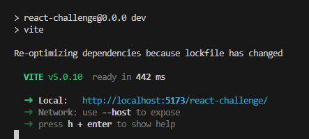
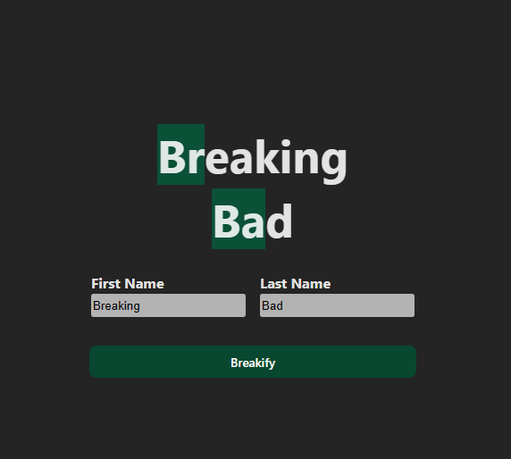
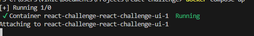
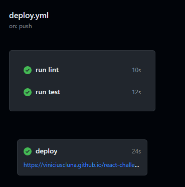
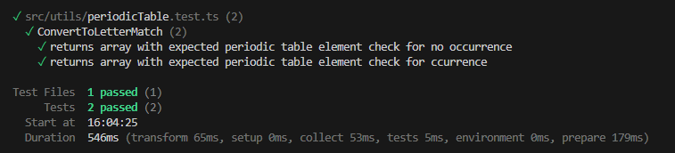

# React Challenge (ReactJs)

## Challenge Rules

1. Fork this public repository ([https://github.com/sebasworkana/react-challenge.git](https://github.com/sebasworkana/react-challenge.git) ), and create a new branch with the name React-Challenge-"Name and Last Name", then push it to the created branch and give access to us to review the code.
2. The main challenge is that you create a Page with the following Style and format.
1. You need to enumerate all Periodic table of the elements on CSS class and make use of it, matching words in First name and last name "Highlighting" them as in the image.
2. First, install "react-redux", then use the useDispatch and useSelector react-redux hooks in the components.
3. For this challenge use redux-thunk in it. Moreover, use the react-redux hooks to give a better impression and avoid older techniques. Share data among components without using props.
4. Is mandatory to use linter like ESLINT
5. Create npm scripts to run project and make sure to create a readme with instructions to run project
6. Will be valuable if you can create Docker compose file to run all environment
7. Use github pages to host web app and test

## Technologies 

- ReactJs
- Vitest
- React Hook Form
- Redux Toolkit (Including Redux Thunk)
- React Redux
- Sass
- Vite

## Running instructions (without docker)

Clone this project and open your favorite terminal.

Run the following command to install the packages (Make sure to have NodeJs installed):
```
npm install
```

After this, run the following command to start your project:
```
npm run dev
```


You should be able to see the app running, by opening the following link:

http://localhost:5173/react-challenge/



## Running instructions (with docker)

Clone this project and open your favorite terminal.

Rrun the following command to start your project (This project wwas pushed to docker hub):
```
docker compose up
```


You should be able to see the app running, by opening the following link:

http://localhost:8080/


## Running instructions (Github pages)

This project wwas integrated with github actions for CICD automation. 
You can see the app running by opening:

https://viniciuscluna.github.io/react-challenge/


There's also automated testing and lint check on each pipeline execution:




## Testing

This project also uses vitest for unit testing 
Reference: https://vitest.dev/guide/
You can run all tests by using the following command:

```
npm install
```

After this, run the following command to start your project:
```
npm run test
```



*Please note that Component Unit testing wasn't included yet. A good approach would be using React Testing Library (RTL). 
Refer to : https://testing-library.com/docs/react-testing-library/intro/*


